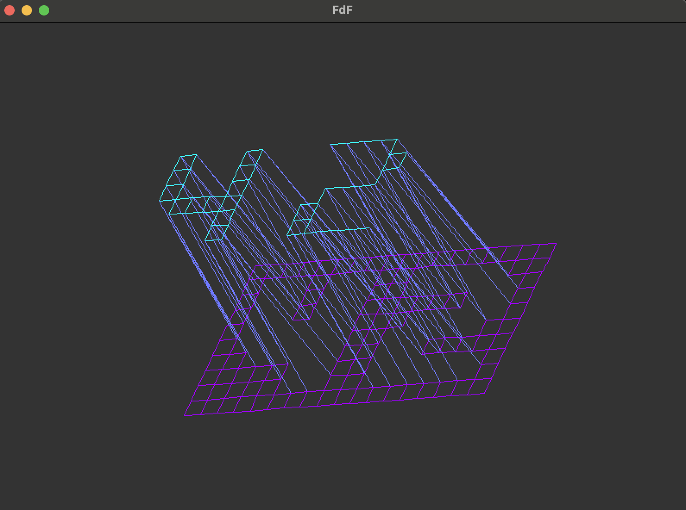
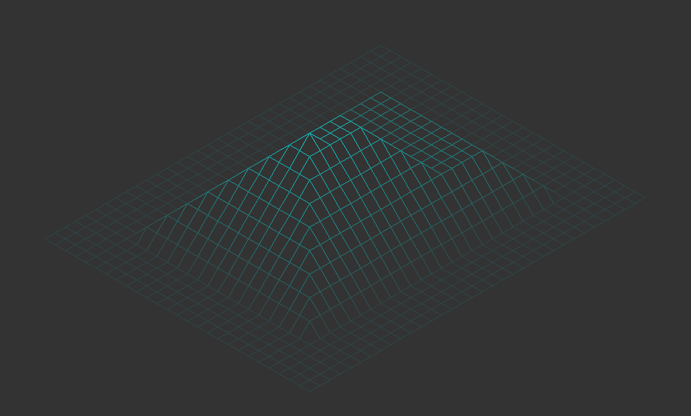
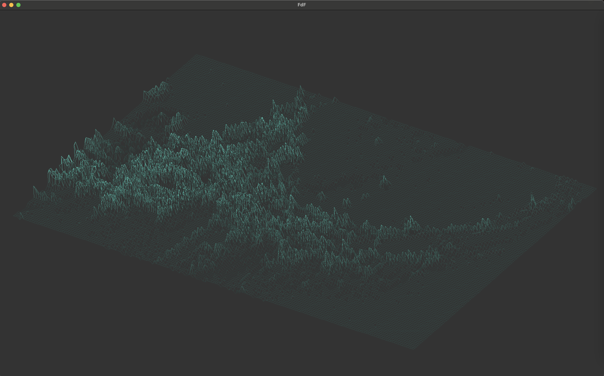

# FdF
This project is an implementation of the classic `FdF` (`Fil de Fer`) project from `42`. It renders a `3D` wireframe model of a landscape (or any `3D` map) from a file containing height values. The project uses `MLX42` for graphical output and includes bonus features such as multiple projection modes, interactive zooming, rotation, and translation.

<br>

## Overview
### 3D Visualization:
The program reads a file containing numerical height values and converts them into a `2D` wireframe model using isometric projection (and optionally, other projections).

### Interactive Transformations:
Users can `zoom in/out`, `rotate`, and `translate` the model via keyboard inputs.

### Multiple Projection Modes (Bonus):
Implemented `Isometric` and `Parallel` projection 

### Gradient Coloring:
Lines are colored with a gradient effect based on the `z-values`, providing a better sense of depth.

<br>

## Features
### File Parsing:
Reads a map file where each number represents a `z-value`, forming a matrix of points.

### Isometric Projection:
Converts `3D` coordinates into `2D` using an isometric projection formula.

### 3D Rotation:
Implements full `3D` rotations (using rotation matrices around the X, Y, and Z axes) before projecting the points.

## Interactive Controls:

+ `[W, A, S, D]` Translation: Move the model around the window
+ `[Q, E]` Rotation: Rotate the model in 3D space
+ `[K, L]` Zoom: Increase/decrease the scale of the model
+ `[ESC]` Exit: Press ESC to close the application
+ `[B, N]` Projection: Change between Isometric and Parallel
+ `[M]` Colors: Switch between 2 types of color pallets
  
<br>

## Usage
Gitclone the repository
```
git clone git@github.com:sknefi/FdF.git
```
```
make 
```

Add binary with map to render
```
./fdf map.fdf
```
Example of .fdf file:
```
0  0  0  0  0  0  0  0  0  0  0  0  0  0  0  0  0  0  0
0  0  0  0  0  0  0  0  0  0  0  0  0  0  0  0  0  0  0
0  0 10 10  0  0 10 10  0  0  0 10 10 10 10 10  0  0  0
0  0 10 10  0  0 10 10  0  0  0  0  0  0  0 10 10  0  0
0  0 10 10  0  0 10 10  0  0  0  0  0  0  0 10 10  0  0
0  0 10 10 10 10 10 10  0  0  0  0 10 10 10 10  0  0  0
0  0  0 10 10 10 10 10  0  0  0 10 10  0  0  0  0  0  0
0  0  0  0  0  0 10 10  0  0  0 10 10  0  0  0  0  0  0
0  0  0  0  0  0 10 10  0  0  0 10 10 10 10 10 10  0  0
0  0  0  0  0  0  0  0  0  0  0  0  0  0  0  0  0  0  0
0  0  0  0  0  0  0  0  0  0  0  0  0  0  0  0  0  0  0

```